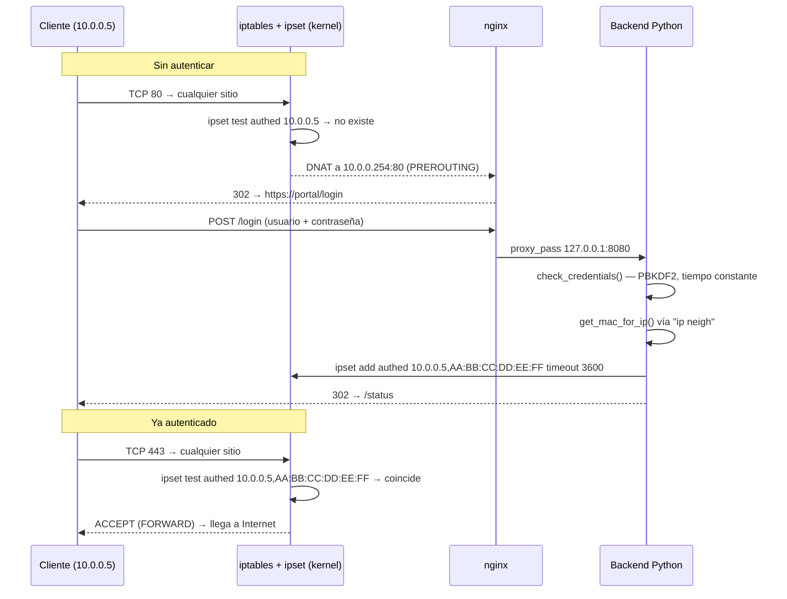
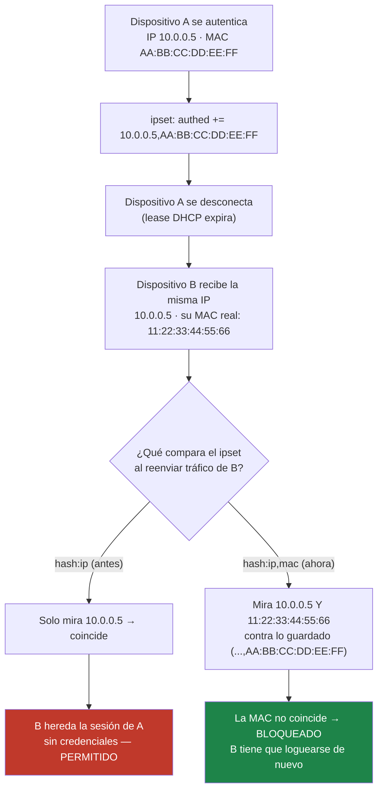

# Arquitectura: flujo de autenticación y defensa contra suplantación

Este documento muestra dos mecanismos que son más fáciles de ver que de
leer: cómo el router intercepta y autentica a un cliente, y por qué la
sesión queda atada a la MAC del dispositivo y no solo a su IP.

## 1. Flujo de redirección y autenticación

El router usa dos puntos de control distintos del firewall: `PREROUTING`
(tabla `nat`) para capturar la primera petición HTTP de un cliente sin
autenticar y redirigirlo al portal, y `FORWARD` (tabla `filter`) para
decidir, en cada paquete, si esa IP+MAC tiene permiso de salir a Internet.

Dos detalles que no se ven leyendo el código de un vistazo:

- **La IP del cliente nunca la dice el cliente.** El backend solo confía en
  la cabecera `X-Real-IP` cuando la conexión TCP viene de `127.0.0.1`
  (nginx) — si alguien pudiera hablarle directo al backend, podría
  falsificarla y suplantar a otro usuario. Por eso el firewall bloquea el
  puerto del backend desde la LAN, no solo nginx confía en la cabecera.
- **La MAC no la manda nadie**: el backend la resuelve por su cuenta con
  `ip neigh show <ip>`, la tabla de vecinos que el propio kernel ya
  completó al recibir el `POST /login` (para responder por TCP, el kernel
  tuvo que resolver esa MAC vía ARP). No hay forma de que el cliente
  reporte una MAC distinta a la real.

## 2. Por qué la sesión no es solo "esa IP tiene acceso"

Este es el hallazgo de seguridad más importante del proyecto. Antes, el
`ipset` guardaba solo la IP autenticada (`hash:ip`). El problema: las IPs
se reasignan — un lease DHCP expira, un dispositivo se desconecta — y la
siguiente IP que las herede heredaba también la sesión de quien la tuvo
antes, sin poner ninguna credencial.

El fix no es lógica de aplicación, es una propiedad del propio `ipset`:
cambiar el tipo de conjunto a `hash:ip,mac` hace que el kernel compare
**ambos** campos, no uno solo.

Verificado de punta a punta contra un `ipset` real (no mockeado): un
dispositivo que hereda la IP de otro con MAC distinta queda
`authenticated: false` en `/status.json` y sin salida a Internet real —
mismo resultado que un cliente que nunca se autenticó. Detalle completo en
[`CAMBIOS_SEGURIDAD.md`](CAMBIOS_SEGURIDAD.md).
